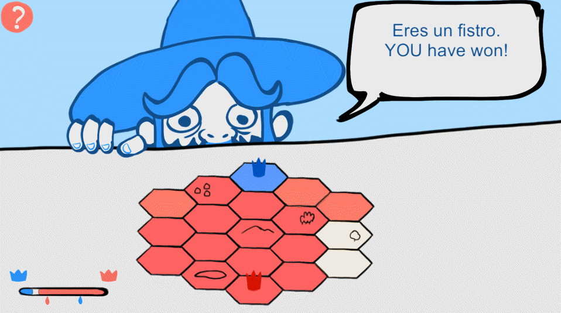

# Reyerta

A short strategy game made for **Ludum Dare 40** (2017).

 Reyerta is a quite naive game of risk management seasoned with humor. The player must choose how much territories want to try to conquer, the more are taken the harder is the task, due to the player must get an equal or greater number rolling a die. Game made with Unity engine.

The theme for this edition of the jam was **The more you have, the worse it is**. You can check the [original entry here](https://ldjam.com/events/ludum-dare/40/reyerta).